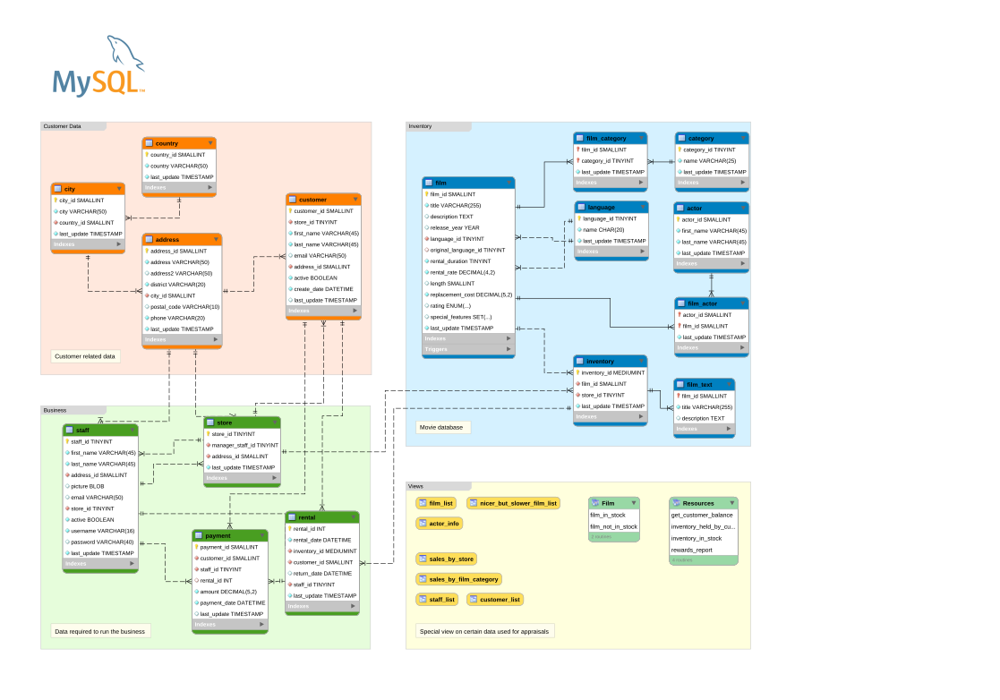
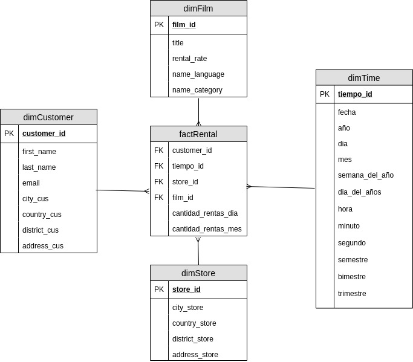

# GestionDeDatos - Proceso ETL

Realizado por:
- Douglas Ardila Garces
- Andres Felipe Avendaño
- Julian Andres Sanchez
- Sebastian Ospina Cabarcas

Documentacion proceso ETL sobre la base de datos relacional Sakila

# Extracción
Se tiene un archivo de formato JSON con datos semi-estructurados de diferentes paises, el objetivo es extraer los datos de este archivo y complementar la tabla country de sakila

Primero definimos el "que", que es lo que se va a hacer para poder "unificar" ambas estructuras.

1. Entender como funcionan las estructuras
2. Entender las fuentes
3. Extraerla
4. Transformar de json a una tabla
5. Comparar y complementarlas
6. Unificar
7. Agregar tabla a sakila

Para llevar a cabo lo anterior creamos un pequeño script en python utilizando la libreria pandas
- [extraccion.py](https://github.com/douglasag17/GestionDeDatos/blob/master/Extraccion/extraccion.py)

Consultas para unificar y crear una sola tabla country, consultas sobre agregaciones y vistas
- [extraccion.sql](https://github.com/douglasag17/GestionDeDatos/blob/master/Extraccion/extraccion.sql)

# Transformación

#### Preguntas del negocio:
1. ¿Cuál fue el cliente que más rentó por mes en el año 2006?
2. ¿Cuál fue el genero de pelicula mas rentado en los meses de octubre de cada año?
3. ¿Cual es el rental_rate de las películas top más rentadas en los últimos 2 años?
4. ¿Que películas son las que menos se han rentado en los últimos 2 años?
5. ¿En qué fechas del mes se realizan menos rentas de acuerdo a los últimos 3 años?
6. ¿Cual es la pelicula mas rentada por país en abril del 2005?
7. ¿Cual es el top 10 de clientes y cuales son los meses en que ellos menos rentan?
8. ¿Cuales clientes son los que más han rentado y en qué género?
9. ¿Qué tienda ha tenido el mayor número de rentas en el último año?
10. ¿Cual es el cliente más fiel (mayor número de rentas por mes)?

#### Reglas de transformacion
- De la tabla customer tomamos tal cual los siguientes campos para construir la dimension dimCustomer y asi poder responder las preguntas del negocio planteadas anteriormente: customer_id first_name, last_name, email. Y desnormalizamos las tablas address, city y country, para asi obtener los siguientes campos: address_cus, city_cus, country_cus y district_cus.
- De la tabla store tomamos tal cual el campo de store_id para construir la dimension dimStore y desnormalizamos las tablas address, city y country, para asi obtener los siguientes campos: address_store, city_store, country_store y district_store.
- De la tabla film tomamos tal cual los siguientes campos para construir la dimension dimFilm y asi poder responder las preguntas del negocio planteadas anteriormente: film_id, title y rental_rate. Y desnormalizamos las tablas category y language, para asi obtener los siguientes campos: name_category y name_language.
- Creamos la dimension tiempo a partir del campo rental_date de la tabla rental y obtuvimos los siguientes campos: fecha, año, dia, mes, semana_del_año, dia_del_años, hora, minuto, segundo, semestre, bimestre, trimestre.
- Para la tabla de hechos factRental se calcularon los siguientes campos cantidad_rentas_dia, cantidad_rentas_mes.

# Carga

#### Modelo OLAP

 
Creamos el esquema de la nueva base de datos sakilaOlap
- [Esquema](https://github.com/douglasag17/GestionDeDatos/blob/master/Carga/schemaOlap.sql)

Procedures para llenar las tablas de dimension y hechos
- [Procedures](https://github.com/douglasag17/GestionDeDatos/blob/master/Carga/fillTablesOlap.sql)
